<h1 >Dataloop SDK Task</h1>

  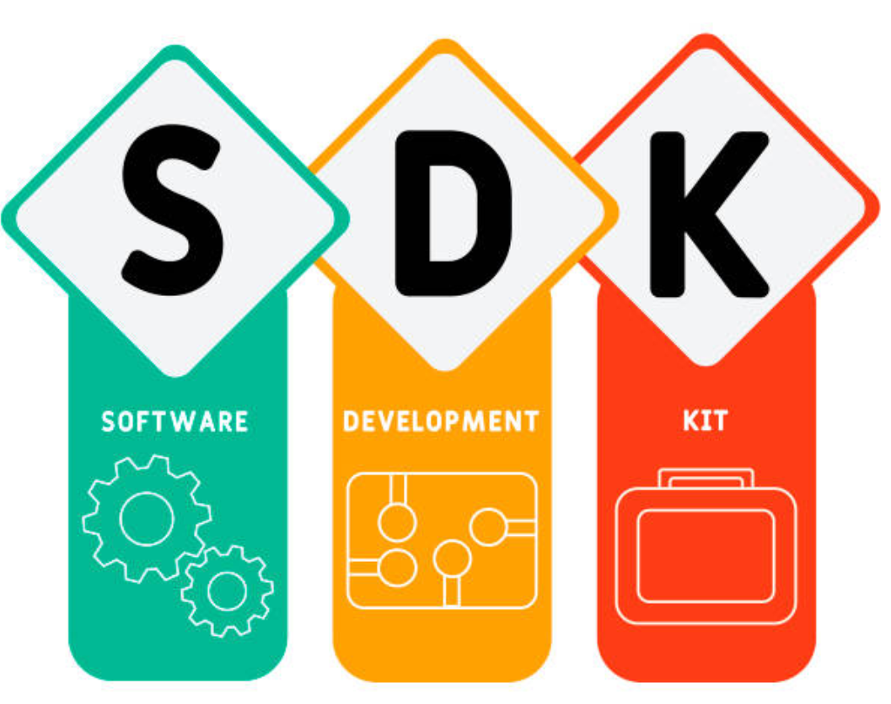

## Table of Contents
- [Description](#Description)
- [Before you begin](#Before-you-begin)
- [Running The Application Locally](#Running-The-Application-Locally)
- [Solution Steps](#Solution-Steps)
## Description
In this task, we will learn how to use Dataloop's Python SDK.

Let’s say you wish to label and classify your images, add a key points on an image with an assigned label “key”, select only images with assigned label "class1" and reteive all points from your images.


### Before you begin
#### Prerequisites
* Python needs to be installed on your system using this [official website](https://www.python.org/downloads/). The SDK supports python version 3.5.4 at least.
* To do this tutorial you must download an environment that supports python.
In this tutorial, I used [PyCharm](https://www.jetbrains.com/pycharm/download/#section=windows).


### Running The Application Locally
1. You should install the “dtlpy” package with the following shell command: <br>
    ```
    pip install dtlpy
    ```
    
2.  Import the package to your python environment : <br>
    ```
    import dtlpy as dl
    ```
3.  Login to the platform: <br>
    ```
    dl.login()
    ```
    you can find more details about login in this [url](https://dataloop.ai/docs/sdk-register)
4. Prepare directory with 5 images of your choice, you can use Google Images or
any free data source you may find or download dogs and cars directory from this repository.

5. Change the sended path paremeter in main function to your own directory's path in previous section. 
6. Run [sdk.py](sdk.py)


## Solution Steps
1. For managing your dataset's photos you need to create storage management tools.
Start with creating a project and adding a dataset inside it, that will hold all of your photos.
*Create a project:*
    ```
    project = dl.projects.create(project_name='SE-project')
    ```
    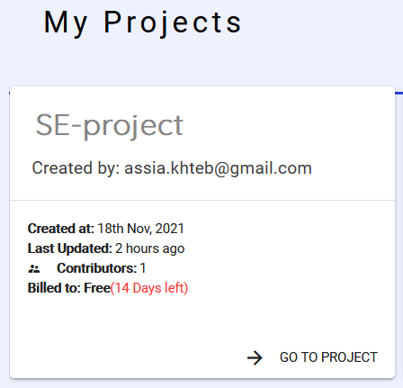

    *Create a dataset inside it:*
    ```
    dataset = project.datasets.create(dataset_name='dogs-and-cars')
    ```
    
    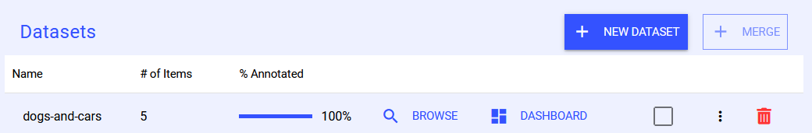    <br>
2. To add a “class1”,"class2" and "key" definition to your data, set “class1”,"class2" and "key" labels in the recipes, which is a dataset list of instructions.<br>
*Define the labels with your choice of color in RGB form:*
    ```
    labels = [{'label_name': 'class1', 'color': (255, 0, 0)},
            {'label_name': 'class2', 'color': (0, 255, 0)},
            {'label_name': 'key', 'color': (0, 0, 255)}]
    ```
    *Add the labels to the Recipe:*
    ```
    dataset.add_labels(label_list=labels)
    ```
    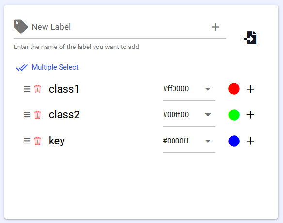
3. Upload all of your photos as items to your “dogs-and-cars” dataset.
    ```
    item = dataset.items.upload(local_path=item_path, remote_path='/dog-car-folder')
    ```
    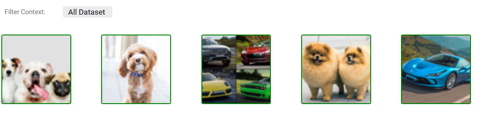
4. Add a UTM metadata to an item user metadata.
    ```
    item.metadata['user'] = dict()
    item.metadata['user']['UTM'] = datetime.now().strftime("%m/%d/%Y, %H:%M:%S")
    ```
    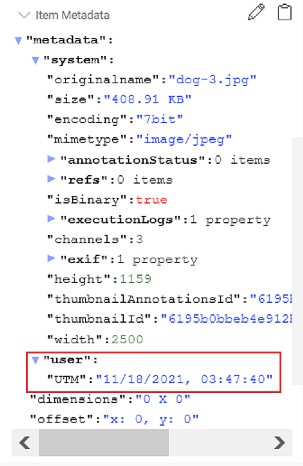
5. Add a classification of class1 to the first two of the images you uploaded.
    Classification Init

    5.1
    *Classification Init*
    Using the annotations definitions classes you can create, edit, view and
    upload platform annotations.
    ```
    annotation_definition = dl.Classification(label=label)
    ```
    5.2
    *Classify a Single Item*
    ```
    `Get item from the platform`
    item = dataset.items.get(filepath=item_path)  
    `Create a builder instance`
    builder = item.annotations.builder()
    `Classify`
    builder.add(annotation_definition=dl.Classification(label=label))
    `Upload classification to the item`
    item.annotations.upload(builder)
    ```


    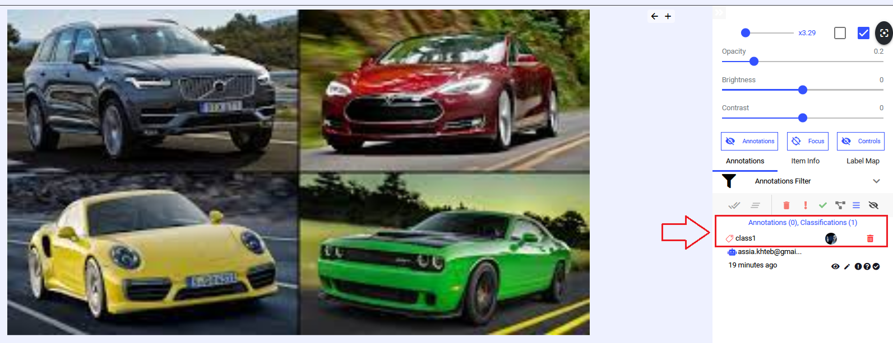
    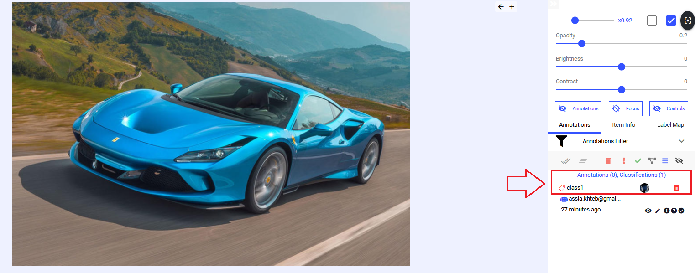
6. Add a classification of class2 to the rest of the images you uploaded
        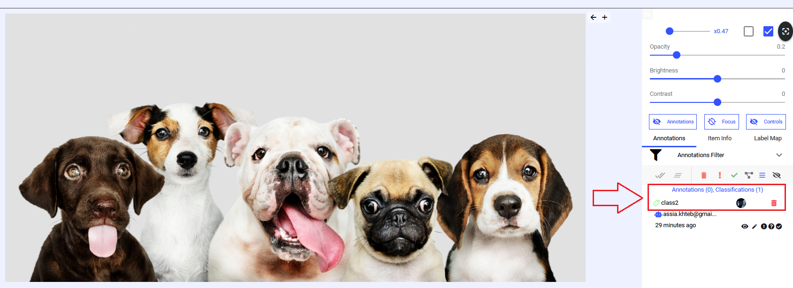
        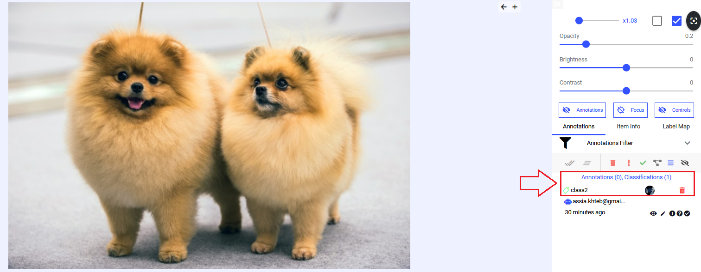
        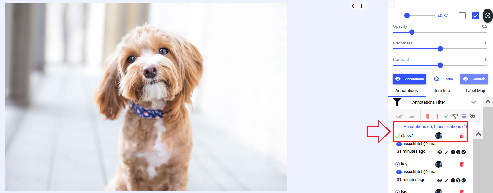
7. Add 5 random key points with the label “key” to one item.
    7.1
    annotation init receives the coordinates for the specific type, label, and optional attributes.
    With x,y coordinates: 
    ```
    annotations_definition = dl.Point(x= x, y= y, label= label)
    ```
    7.2
    Create a Point Annotation
    ```
    `Create a builder instance`
    builder = item.annotations.builder() 
    `Create point annotation with label and attribute `
    builder.add(annotation_definition=dl.Point(x=x,
                                               y=y,
                                               label=label)) 
    `Upload point to the item`                                           
    item.annotations.upload(builder) 
    ```
    7.3
    Get height and width of the image to add the key points within the image borders and calculate x and y randomly.
    ```
    x = random.randint(0, item.metadata['system']['width'])
    y = random.randint(0, item.metadata['system']['height'])
    ```
    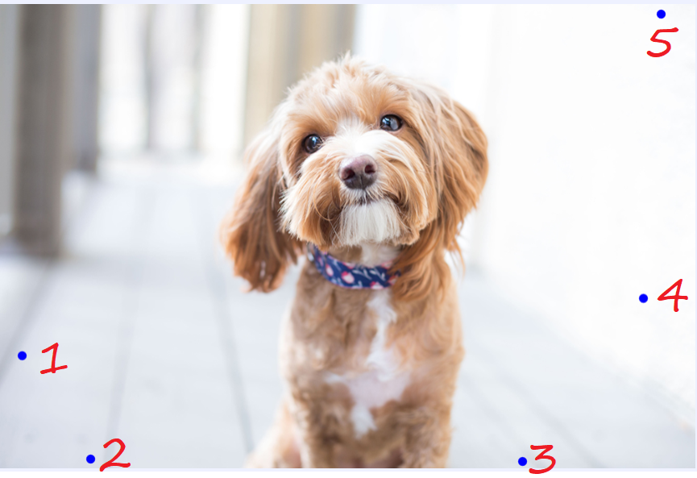
8. Create a query that selects only image items that have been labeled as “class1”.
    *Query*
    ```
    `Create filters instance`
    filters = dl.Filters()  
    `Filter only annotated items with label 'class1'`
    filters.add_join(field='label', values='class1')  
    `Get filtered items list in a page object`
    pages = dataset.items.list(filters=filters) 
    ```   
    *Outputs*
    ```
    Number of filtered items in dataset: 2
    |    | annotated   | filename                                | name      | type   | id                       | hidden   | dir                           |   annotationsCount | dataset                                                           | createdAt                | datasetId                |
    |  0 | True        | /dog-car-folder/dogs and cars/car-2.jpg | car-2.jpg | file   | 6195b0baa5b393d186f677ec | False    | /dog-car-folder/dogs and cars |                  1 | https://gate.dataloop.ai/api/v1/datasets/6195b0b7642e3ee786c2250c | 2021-11-18T01:47:38.000Z | 6195b0b7642e3ee786c2250c |
    |  0 | True        | /dog-car-folder/dogs and cars/car-1.jpg | car-1.jpg | file   | 6195b0ba8ee9536781978a9f | False    | /dog-car-folder/dogs and cars |                  1 | https://gate.dataloop.ai/api/v1/datasets/6195b0b7642e3ee786c2250c | 2021-11-18T01:47:38.000Z | 6195b0b7642e3ee786c2250c |
    ```
    And as we see from section [5.2](5.2) the cars are labeled with "class1".
9. Create a query that retrieves all point annotations from the dataset.
   *Query*
    ```
    `Create filters instance`
    filters = dl.Filters()  
    `Filter only annotated items with point`
    filters.add_join(field='type', values='point')
    `Get filtered items list in a page object`
    pages = dataset.items.list(filters=filters)
    ```   
    *Outputs*
    ```
    Number of items in dataset: 1
    |    | annotated   | filename                                | name      | type   | id                       | hidden   | dir                           |   annotationsCount | dataset                                                           | createdAt                | datasetId                |
    |  0 | True        | /dog-car-folder/dogs and cars/dog-1.jpg | dog-1.jpg | file   | 6195b0ba475d459a253245cb | False    | /dog-car-folder/dogs and cars |                  6 | https://gate.dataloop.ai/api/v1/datasets/6195b0b7642e3ee786c2250c | 2021-11-18T01:47:38.000Z | 6195b0b7642e3ee786c2250c |

    0  Annotation(id='6195b0bdddb4dd6961e29b0d', item...
    1  Annotation(id='6195b0be2af74735c2497ef3', item...
    2  Annotation(id='6195b0be642e3e3b42c22515', item...
    3  Annotation(id='6195b0be232ef648949ce376', item...
    4  Annotation(id='6195b0beb75fa9da8772281d', item...
    ```

## UI and preparation
Annotate the images with tools of your choice. Try and use at least 2 types of annotation tools.   
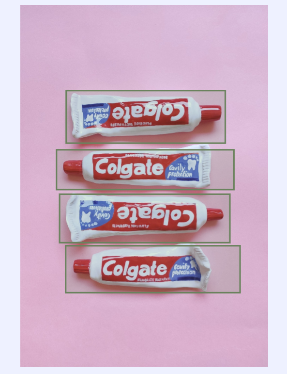


## Resources
[Dataloop documentation](https://dataloop.ai/docs) <br>
[dataloop SDK](https://dataloop.ai/docs/sdk-register) <br>
[SDK Cheat Sheet](https://dataloop.ai/docs/sdk-cheatsheet?highlight=Create%20a%20project%20sdk)<br>
[Item Metadata](https://dataloop.ai/docs/sdk-add-item-metadata)<br>
[Classification SDK](https://dataloop.ai/docs/sdk-classify-item?highlight=class)<br>
[Point SDK](https://dataloop.ai/docs/sdk-create-point-annotation)<br>
[Sort & Filter: Item Level](https://dataloop.ai/docs/sdk-sort-filter)<br>
[Sort & Filter: Annotation Level](https://dataloop.ai/docs/sdk-sort-filter-annotation)<br>
